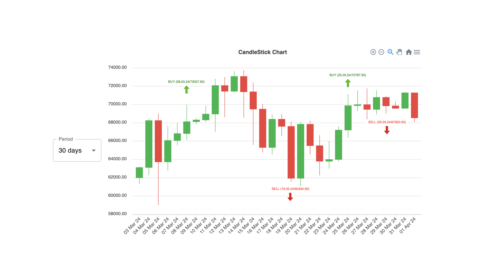
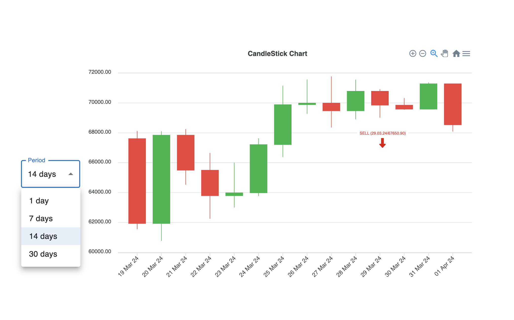
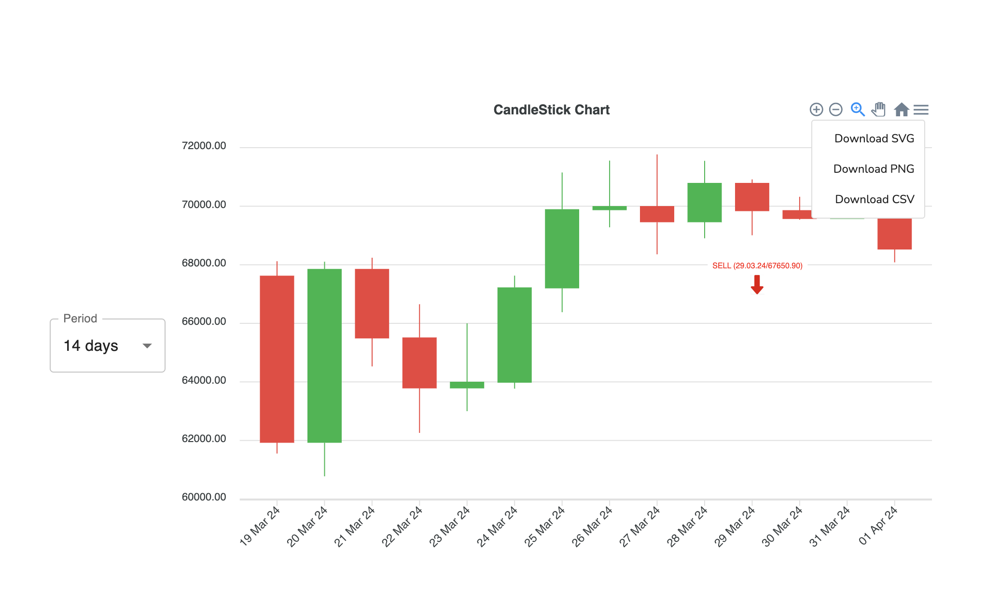

### React Test Task

This is a test project created for evaluating React skills. It includes a sample React application with various dependencies for styling, testing, and data visualization.

#### Dependencies

- **@eslint/js**: ESLint for JavaScript linting.
- **@mui/material**: Material-UI library for React components.
- **@testing-library/jest-dom**: Custom Jest matchers for DOM testing.
- **@testing-library/react**: Testing utilities for React applications.
- **@testing-library/user-event**: Simulate user events for testing.
- **apexcharts**: Interactive JavaScript charts library.
- **dayjs**: Date utility library.
- **react**: Core React library.
- **react-apexcharts**: React wrapper for ApexCharts.
- **react-dom**: React DOM library for rendering React components.
- **react-scripts**: Scripts and configuration used by Create React App.
- **sass**: Sass preprocessor for styling.
- **typescript**: TypeScript for type-checking JavaScript code.
- **web-vitals**: Metrics to measure the performance of web pages.
- **yup**: Schema validation library.

#### Scripts
- **start**: Start the development server.
- **build**: Build the application for production.
- **test**: Run tests using Jest.
- **eject**: Copy configuration files and dependencies to the project.
- **lint:js**: Lint JavaScript files using ESLint.

#### Development Dependencies
- **@types/eslint__js**: TypeScript type definitions for ESLint.
- **@types/react**: TypeScript type definitions for React.
- **@types/react-dom**: TypeScript type definitions for React DOM.
- **@typescript-eslint/parser**: Parser for TypeScript code in ESLint.
- **eslint**: JavaScript linting utility.
- **node-sass**: Node.js bindings to LibSass.
- **prettier**: Code formatter for JavaScript, TypeScript, and CSS.
- **sass-loader**: Sass loader for Webpack.
- **webpack**: Bundler for JavaScript applications.

#### Usage
1. Clone the repository.
2. Install dependencies using `npm install`.
3. Start the development server with `npm start`.
4. Build the application for production with `npm run build`.
5. Run tests using `npm test`.

### Example Images

For more details, visit the [GitHub repository](https://github.com/San-in/test-task-apex/).
